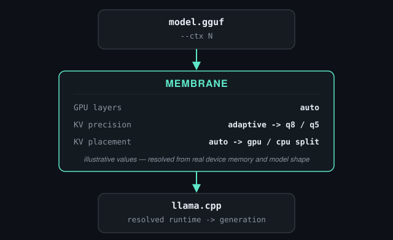
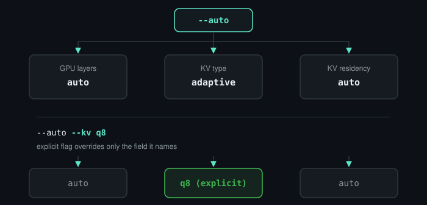
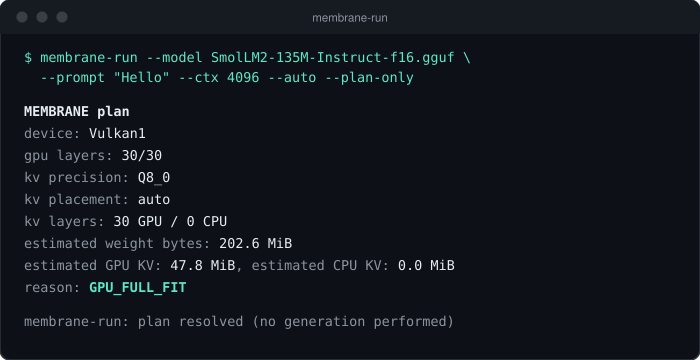
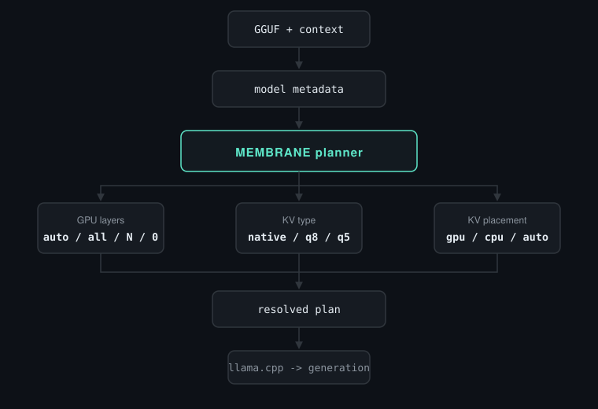
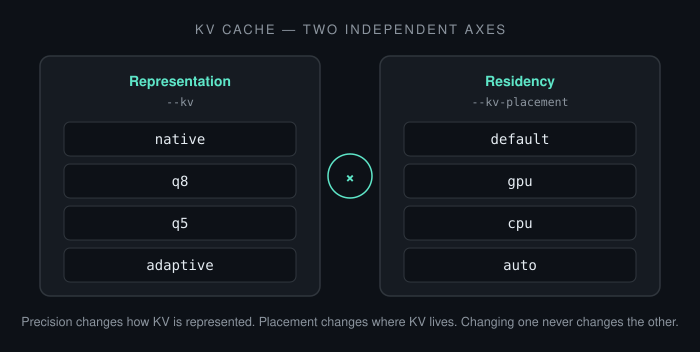
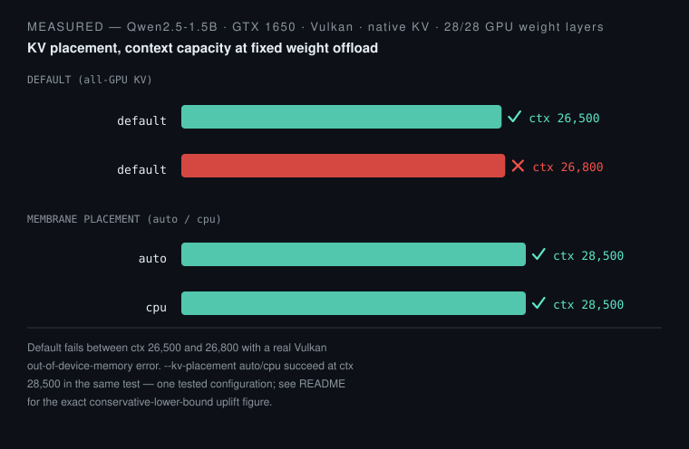
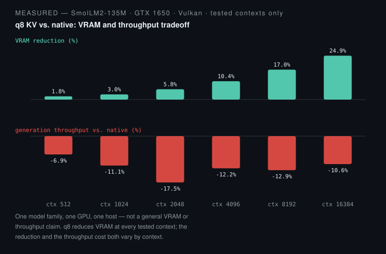

# MEMBRANE

Adaptive KV-cache planning for llama.cpp under constrained memory.

MEMBRANE resolves GPU offload, KV precision, and CPU/GPU KV residency before
generation starts — with an inspectable plan and machine-readable
diagnostics, on top of an unmodified `ggml`/llama.cpp inference path.

[](https://github.com/kadireren7/membrane/actions/workflows/ci.yml)
[](https://github.com/kadireren7/membrane/actions/workflows/codeql.yml)
[](LICENSE)



KV-cache memory grows with context length, and on a memory-constrained GPU
it's often what runs out before compute does. MEMBRANE looks at real device
memory and model shape before committing to a plan, instead of a fixed
`-ngl` guess that either wastes headroom or fails mid-run.

## Build

Easiest path on Ubuntu/Debian/Pop!_OS: a `.deb` package
(`sudo apt install ./membrane_<version>_amd64.deb`) — no manual CMake
flags. That one package is Vulkan-enabled but runs correctly CPU-only
(GPU offload stays opt-in, `--auto`/`--gpu-layers`); a CPU-only
`membrane-cpu_<version>_amd64.deb` also exists as a CI-validation/
build-your-own artifact. Release packages are produced by this
project's build pipeline; none are hosted publicly yet, so build your
own with `cmake --build <dir> --target package` (see
[`docs/install.md`](docs/install.md)'s Option A). What follows here is
building `membrane-run` directly from source.

CPU-only:

```bash
cmake -S . -B build-llama -DMEMBRANE_ENABLE_LLAMA=ON -DCMAKE_BUILD_TYPE=Release
cmake --build build-llama -j --target membrane-run
```

Vulkan (needs Vulkan development headers, `glslc`, and SPIR-V headers
already on the system):

```bash
cmake -S . -B build-vulkan -DMEMBRANE_ENABLE_LLAMA=ON -DGGML_VULKAN=ON -DCMAKE_BUILD_TYPE=Release
cmake --build build-vulkan -j --target membrane-run
```

Full walkthrough (install/uninstall, troubleshooting):
[`docs/install.md`](docs/install.md). No CUDA, no GPU, no driver needed for
a CPU-only build. Full flag reference and exit codes: `membrane-run
--help`. Reproduction guide (llama-free core library, sanitizers, CI):
`docs/reproduction.md`.

## Quick Start

Install → check → inspect → preview → run. No `Q8_0` block internals, no
planner internals, no phase history required to get here — just five
commands, each one optional past the first:

```bash
# Check what MEMBRANE sees on this host (no model needed)
membrane-run --doctor

# Point it at your model and see if it supports compressed KV -- no
# generation, cheap
membrane-run --model model.gguf --inspect-model

# Run it -- CPU inference, full-precision KV, no flags to learn first
membrane-run --model model.gguf --prompt "Hello"

# Once that works, preview what --auto would choose (needs an explicit
# --ctx -- memory planning depends on knowing the context size up front)
membrane-run --model model.gguf --ctx 2048 --auto --plan-only

# Then actually run it with --auto managing GPU offload and KV memory
membrane-run --model model.gguf --prompt "Hello" --ctx 2048 --auto
```



You never need to know `q8`/`q5`, GPU layer counts, or KV placement to use
`--auto` — see "Precision and placement are separate" below only if you
want manual control. `membrane-run --list-devices` lists every backend
device MEMBRANE can see (no model needed).

Explicit flags override only the field they name — `--auto --kv q8` keeps
GPU layers and KV placement on auto while pinning precision to `q8`.
Advanced options (KV precision/placement, GPU device selection, JSON
diagnostics): `membrane-run --help`.

## See the plan before you run it

`--plan-only` resolves the exact same planner a real run uses and prints the
result without generating a token:

```bash
./build-vulkan/tools/membrane-run/membrane-run \
  --model model.gguf --prompt "Hello" --ctx 32768 --auto --plan-only
```



Real output — captured verbatim, transcript and command in
[`docs/assets/source/plan-example.txt`](docs/assets/source/plan-example.txt).
Add `--json` for the same plan as one machine-readable object
(`schema_version: 1`) instead of this text block; add `--verbose` for the
full requested/resolved breakdown and reason trace. Both go to stderr, so
`--json` on stdout stays pure JSON either way.

## How MEMBRANE works



One logical planning pipeline, not three independent tools. GPU layer count
comes from a pre-load memory estimate; KV precision and KV placement finish
resolving once real model shape is available, before the KV cache/context
itself is constructed. There is no runtime KV migration and no per-layer
mixed precision — see "Current scope" below.

## Precision and placement are separate



`--kv` never changes where the cache lives. `--kv-placement` never changes
how it's encoded.

## Measured results

MEMBRANE plans against whatever memory is actually available on the machine
it runs on. The numbers below are two specific tested configurations, not a
general hardware claim — a different GPU or model will measure differently.



Source: `results/v0.3/kv-residency-productization/capacity_uplift.json`,
re-verified by `scripts/verify-results.py`: the default all-GPU-KV path
succeeds at `ctx=26500` and fails at `ctx=26800` with a real Vulkan
out-of-device-memory error; `--kv-placement auto`/`cpu` both succeed at
`ctx=28500` in the same test. This Qwen2.5 result validates KV
**placement** at **native** precision — the current `qwen2` architecture
compatibility check does not validate `q8`/`q5`/adaptive KV **compression**
for that model family (only `LLM_ARCH_LLAMA` models are validated for
compressed KV).



Source: `results/v0.3/gpu-vulkan-validation.json`, SmolLM2-135M on the
tested GTX 1650: VRAM reduction ran from roughly 2% at small contexts up to
roughly 25% at `ctx=16384`, while generation speed measured roughly 7-18%
lower than native across the same sweep. This is a tradeoff, not a speedup —
`q8` reduces VRAM at every tested context at a real throughput cost. At the
same tested point, 5 generated-text outputs across every `q8`/`q5`/placement
combination were byte-identical (md5-verified, `quality.json`) — generated
text only, not a token-ID or numeric quantization-error claim.

## Current capabilities

| Supported | Not a product path | Research only |
|---|---|---|
| CPU inference | CUDA | Dynamic/runtime KV migration |
| Vulkan GPU offload | | Per-layer mixed `q8`/`q5` precision |
| KV precision: `q8`, `q5`, adaptive | | FPGA/CXL (simulation/synthesis-tool evidence only) |
| Static CPU/GPU KV residency | | |
| `--auto` planning | | |
| `--plan-only` / `--verbose` diagnostics | | |
| `--doctor` / `--list-devices` / `--inspect-model` | | |
| JSON diagnostics (`schema_version: 1`) | | |

## Install

```bash
cmake --install build-vulkan --prefix "$HOME/.local"
```

Installs `membrane-run` plus its shared-library dependencies (`llama`,
`ggml*`, and `ggml-vulkan` when built with Vulkan enabled), each with
an `$ORIGIN`-relative RPATH, so the installed binary runs standalone —
no build tree, no `LD_LIBRARY_PATH`. `membrane_core` is always linked
statically into `membrane-run` and is never installed on its own.
`cmake --build build-vulkan --target uninstall` removes exactly what
that install run recorded. Full walkthrough,
troubleshooting, and the CPU-vs-Vulkan dependency footprint:
[`docs/install.md`](docs/install.md).

## Current scope

- Linux-focused development and testing.
- Vulkan is the only product GPU backend; CUDA is not currently supported.
- KV placement is decided once, before context construction — no runtime
  migration, promotion, or demotion.
- Adaptive KV selection is whole-cache (`q8` or `q5` for the entire
  context), never per-layer or per-block.
- Memory figures in a plan are pre-load estimates and point-in-time
  snapshots, not measured peak VRAM or an OOM guarantee.
- `q8`/`q5`/adaptive KV precision is validated only for `LLM_ARCH_LLAMA`
  models — checked and rejected for other architectures before use.

Mechanism detail: `docs/live-runtime.md` (KV precision) and
`docs/kv-residency.md` (KV placement). Full architecture/backend/
precision/placement compatibility matrix: `docs/compatibility.md`.
`--auto`'s joint GPU-layers/precision/placement planner:
`docs/joint-planner.md`. Bounded apply-time fallback if the primary
plan can't be instantiated: `docs/auto-fallback.md`.

## Research & provenance

This repository intentionally keeps no experiment branches or phase-by-phase
research history. Full experiment records, negative results, and FPGA/CXL
research (simulation and synthesis-tool proxies only, no physical hardware)
live in
**[kadireren7/membrane-research](https://github.com/kadireren7/membrane-research)**,
with SHA256-verified provenance back to this repository.

**Release status**: latest stable tag `v0.2.0`, release candidate
`v0.3.0-rc3` (supersedes the now-stale `v0.3.0-rc2`, which predates
Qwen2 compressed-KV support, performance-profiling/planner-substage
timing diagnostics, the fallback trace on a fully-exhausted error JSON,
and real-user validation on CPU/NVIDIA-Vulkan/AMD-Vulkan — all still
from a single physical developer host; independent-host validation
remains pending — see
[docs/release-v0.3.0-rc3.md](docs/release-v0.3.0-rc3.md) for the full
RC2→RC3 delta). `v0.2.0` stable's CPU-only default behavior is
unchanged by any of this.

## AI-assisted development

Kadir Eren Altıntaş leads project architecture, experiment selection,
validation criteria, and release decisions. AI coding agents have assisted
implementation, analysis automation, documentation, and review. Full
disclosure:
[kadireren7/membrane-research](https://github.com/kadireren7/membrane-research)'s
`outreach/ai-assistance-disclosure.md`.

## License

Apache License 2.0 for MEMBRANE's own code — see [LICENSE](LICENSE).
The `third_party/llama.cpp` submodule and any model artifacts are under
their own separate terms — see [docs/licensing.md](docs/licensing.md).
Citation: [CITATION.cff](CITATION.cff).

---

Contributing: [CONTRIBUTING.md](CONTRIBUTING.md). Security: [SECURITY.md](SECURITY.md).
Support: [SUPPORT.md](SUPPORT.md). Community standards: [CODE_OF_CONDUCT.md](CODE_OF_CONDUCT.md).
