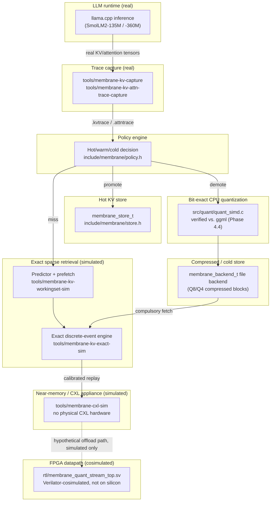
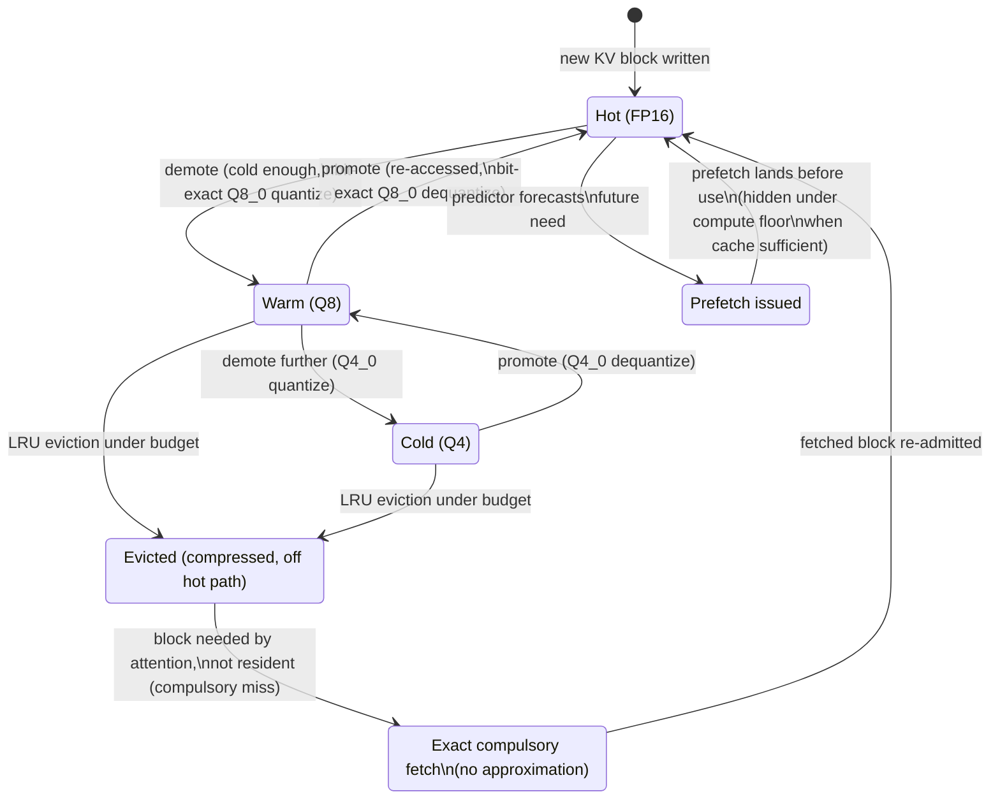
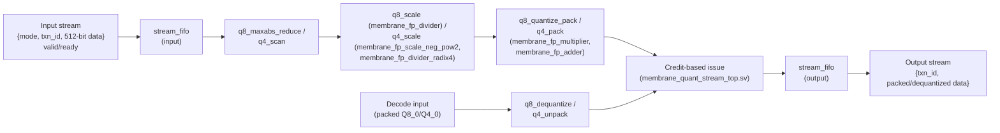
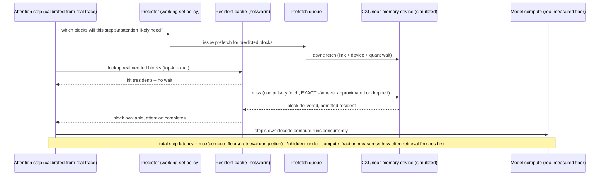

# MEMBRANE Architecture

## Scope of this document

This document describes what MEMBRANE actually is as of the public
research-release audit (see `docs/research-release-freeze.md`), with
diagrams matching the current code, not the Phase 0 block-store-only
prototype this document originally described. Every diagram below
corresponds to real, present source files, named inline. Nothing here
claims a capability that isn't implemented, tested, or (where explicitly
labeled) simulated.

For the phase-by-phase research narrative behind each piece, see the
`docs/phase*.md` files — this document is the current-state summary, not
a replacement for them.

## Phase history (summary)

- **Phase 0–1**: lossless block store, pluggable codecs (RAW/RLE), a
  budget-aware LRU store with a file-backed cold tier. Still present
  (`include/membrane/store.h`, `include/membrane/backend.h`) and exercised
  by `test_store`/`test_store_backend`/`test_store_concurrent`, but no
  longer the project's focus.
- **Phase 2**: real KV-cache tensor capture and compressibility analysis —
  the negative result that motivated everything after it (blind
  byte-level compression does not work on real KV data; see
  [phase2-kv-analysis.md](phase2-kv-analysis.md) and
  [results-summary.md](results-summary.md) §4).
- **Phase 3**: llama.cpp-calibrated Q8 KV quantization, adaptive/
  composition-aware/risk-aware policy variants, cross-model validation
  (SmolLM2-135M and -360M).
- **Phase 4**: bit-exact ggml quantization parity, runtime policy
  calibration, and runtime variance root-causing.
- **Phase 5**: predictive prefetch, PCIe/FPGA hardware-in-the-loop
  emulation, and the fully synthesizable FPGA quant/dequant datapath.
- **Phase 6**: near-memory/CXL appliance simulation, attention working-set
  analysis, exact sparse KV retrieval at scale, the unified
  128K-context × 512-concurrency stress sweep, and an out-of-core
  simulator backend to complete that sweep under real memory constraints.
- **Phase 7.1**: research-release packaging — no new experiments, only
  reproducible presentation of the above (see
  [phase7-research-release.md](phase7-research-release.md)).
- **Phase 7.2**: academic manuscript — literature research (14
  independently-verified sources), claim audit, and a complete,
  citation-resolved paper (see
  [phase7-academic-paper.md](phase7-academic-paper.md)).
- **Phase 7.3**: hardware-validation outreach package and physical
  validation plan (see
  [phase7-hardware-outreach.md](phase7-hardware-outreach.md) and
  [phase8-hardware-validation-plan.md](phase8-hardware-validation-plan.md)),
  followed by an authorship/AI-assistance wording correction and a
  GitHub Actions verification repair (`bb4df95`, `58ec90b`) confirmed on
  the real CI runner, and this public-release audit (see
  [research-release-freeze.md](research-release-freeze.md) and
  [public-release-audit.md](public-release-audit.md)) — still no new
  experiments and still no physical FPGA/CXL hardware used.

## A. End-to-end MEMBRANE system

Notes on this diagram: the dotted CXL→FPGA edge is explicitly simulated,
not a real data path — no component in this project moves real bytes over
a real PCIe/CXL link. `membrane-cxl-sim` and `membrane-kv-exact-sim` are
discrete-event simulators calibrated from the real traces `membrane-kv-
capture`/`membrane-kv-attn-trace-capture` produce; they do not themselves
run inference.

## B. KV lifecycle (hot → warm → cold, exact miss path)

Every transition except the two "Predicted" ones is exercised by
`test_workingset_policy`/`test_exact_engine`; the quantize/dequantize
edges are the same code path verified bit-exact against ggml in
`test_ggml_quant_parity`. "Exact miss" never returns a degraded or
approximated block — it is a real fetch, simulated with real latency
(link/device/quant-engine wait), not a lossy substitute.

## C. FPGA datapath (synthesizable, Verilator-cosimulated)

All arithmetic blocks (`membrane_fp_adder/divider/multiplier`) are
from-scratch, bit-exact, purely-integer FP32 primitives — no `real`,
`shortreal`, or DPI anywhere in this datapath, and the whole hierarchy
elaborates under yosys 0.33. This diagram is the same module graph
cosimulated by `rtl/tb/tb_top_verilator.cpp` against
`src/quant/quant_simd.c` for 520,000 transactions, 0 mismatches (see
[phase5-synthesizable-fpga.md](phase5-synthesizable-fpga.md) §4). It has
not been placed or routed on a physical FPGA.

**`q4_scale`'s divider replacement (reflected in the diagram above)**:
`q4_scale`'s two `membrane_fp_divider` instances were replaced with
`membrane_fp_scale_neg_pow2.sv` (an exact power-of-two shortcut for the
constant `mx/-8.0f` operation) and `membrane_fp_divider_radix4.sv` (an
exact, multi-cycle, two-quotient-bit-per-cycle iterative divider for the
variable `1/d` operation), plus the minimal Q4_0-encode issue-serialization
change ("Ordering guarantee" in `membrane_quant_stream_top.sv`'s own header
comment) that divider's variable latency requires. `q8_scale.sv` (still
`membrane_fp_divider`, both instances) and the external
`membrane_quant_stream_top` port list are unchanged. Source:
EXP-FPGA-DIV-001 (`experiments/EXP-FPGA-DIV-001/`), Phase B1/B4 —
SIMULATED/SYNTHESIZED only (Verilator cosimulation + yosys generic/ECP5
cell counts), no real FPGA hardware or place-and-route data, same
disclosure as the rest of this section. Merged via pull request
[#2](https://github.com/kadireren7/membrane/pull/2) (squash commit
`f96c695`); see `experiments/EXP-FPGA-DIV-001/README.md` for the full
research-record index and `promotion-plan.md`/`promotion-comparison.md`
for the detailed integration plan and reproduced comparison.

## D. Exact sparse retrieval path

This is the path `tools/membrane-kv-exact-sim`'s `calibrate()` +
`run_concurrent()` implement: `calibrate()` walks a real captured trace
once to build a `calibrated_profile_t` (predictor decisions, ground-truth
top-k blocks per step); `run_concurrent()` replays that profile across up
to 512 concurrent sequences with real shared-resource contention (link,
device, quant-engine queues), never re-touching the raw trace. The
predictor's precision/recall is measured against ground truth every step
— it is never assumed correct.
